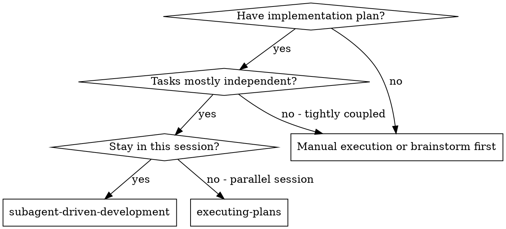
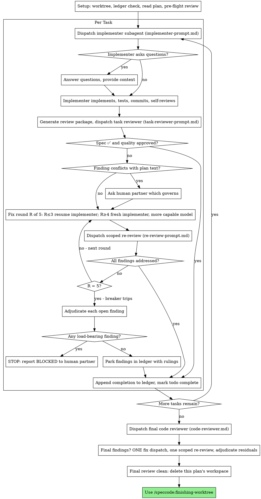

# Subagent 驱动开发(Subagent-Driven Development)

执行 plan 的方式:每个任务派发一个全新的实现者子代理,其后做一次任务审查(spec 符合性 + 代码质量),最后做一次覆盖整支的终审。

**为什么用 subagent:** 你把任务委派给拥有隔离上下文的专门代理。通过精确构造它们的指令与上下文,你确保它们聚焦并胜任自己的任务。它们绝不应继承你会话的上下文或历史——你要精确构造它们需要的一切。这也把你自己的上下文留给协调工作。

**核心原则:** 每任务一个全新子代理 + 任务审查(spec + 质量)+ 整支终审 = 高质量、快迭代

**叙述(Narration)上限:** 在工具调用之间,至多叙述一行短句——ledger 与工具结果本身就是记录。

**连续执行:** 不要在任务之间停下来向人类伙伴请示。把 plan 里的所有任务不间断地执行完。停下来的唯一理由是:无法解决的 BLOCKED 状态、真正阻碍推进的歧义、或所有任务已完成。"我可以继续吗?"式的询问与进度小结是在浪费对方时间——对方让你执行 plan,那就执行它。

## 何时使用



**对比 Executing Plans(并行会话):**
- 同一会话(无上下文切换)
- 每任务一个全新子代理(无上下文污染)
- 每任务之后审查(spec 符合性 + 代码质量),结尾整支终审
- 更快迭代(任务之间没有 human-in-loop)

## 流程



## 准备(Setup)

确保工作发生在隔离工作区中:你应当已经在 speccode worktree 里(由 `/speccode:creating-worktree` 创建)。未经人类伙伴明确同意,MUST NOT 在 main/master 分支上开始实现。

**绑定功能分支**:运行 `speccode.mjs reconcile --cwd .`,用返回的 features 找到当前 worktree 所属的功能分支 F;找不到 → 报错"当前 worktree 无法关联任何 active feature",退出。

**读记忆**:运行 `speccode.mjs read-memory --cwd . --branch <F>`;返回非 null 时把 memory 内容作为既有上下文参考,再继续——memory 上下文 MUST 参与下面的 plan 通读与 pre-flight 冲突扫描。

对话记忆扛不过压缩(compaction)。真实会话中,丢了位置的控制器曾把整段已完成任务序列重新派发——这是观测到的最昂贵失败。用 ledger 文件跟踪进度,而不是只靠 todo。

- 每个 plan 拥有一个工作区:命令开始时运行
  `speccode.mjs sdd-workspace --cwd . --plan <PLAN_FILE>`——它输出 JSON,取 `dir` 字段即该 plan 的目录(`<repo-root>/.speccode/sdd/<plan-basename>/`),本 plan 的所有工件都放这里:ledger、brief、报告、review package。
  另一个 plan 的目录永远不归你读写。
- 检查本 plan 的 ledger 是否在 `<workspace>/progress.md`。如果它第一行写的是你的 plan 文件,那么凡是有 `Task <N>: complete` 行的任务都是 DONE——不要重新派发;从第一个没有完成行的任务继续。最后一行是 fix round 的任务处于循环中途:从下一轮继续循环。第一行写的是别的 plan 文件——或是旧扁平路径 `.speccode/sdd/progress.md` 上的流浪 ledger——那是别的 plan 的进度:留在原地,自己从零开一个新的。
- 创建 ledger 时,第一行写它的身份:
  `# SDD ledger — plan: <plan file path>`。
- ledger 是你的恢复地图:它记录的 commit 即使在你的上下文已经遗忘之后,仍然存在于 git 里。压缩之后,相信 ledger 和 `git log`,而不是你自己的回忆。
- 工作区在目标项目里是 untracked 的草稿区;插件会在 `.speccode/sdd/` 下维护一份内容为 `*` 的 `.gitignore` 自忽略(只写插件自有目录内的文件,不碰用户的 `.gitignore`),使各 plan 工作区不进 `git status`、不被 `git clean -fd`(无 `-x`)摧毁。`git clean -fdx` 仍会摧毁工作区;若发生,从 `git log` 恢复。

把 plan 通读一遍,记下它的上下文与 Global Constraints,为每个任务建一个 todo。

派发 Task 1 之前,先扫一遍 plan 找冲突:

- 任务之间相互矛盾、或与 plan 的 Global Constraints 矛盾
- plan 明确要求、但审查 rubric 视为缺陷的东西(什么都不断言的测试、逐字重复的逻辑块)

把你发现的一切作为一个批量问题呈给人类伙伴——每条发现旁边附上 mandate 它的 plan 文本,问哪个为准——在执行开始之前问,而不是在 plan 执行中途每发现一条打断一次。如果扫描干净,不做评论直接继续。审查循环仍是兜住那些只有实现中才暴露的冲突的网。

## 模型选择(Model Selection)

每个角色用够用的最弱模型,以省成本、提速度。

**机械实现任务**(孤立函数、明确 spec、1-2 个文件):用快而便宜的模型。plan 写得足够具体时,大多数实现任务都是机械任务。

**集成与判断任务**(多文件协调、模式匹配、调试):用标准模型。

**架构与设计任务**:用可用的最强模型。
最后的整支终审就属于这一类——用可用的最强模型派发它,不要用会话默认模型。

**审查任务**:选判断力相当、并按 diff 的大小、复杂度与风险伸缩的模型。一个小的机械 diff 不需要最强模型;一个微妙的并发改动需要。对小修复 diff 的范围化 re-review,用便宜到中档即可。

**修复循环升级(第 4-5 轮)**:用比卡住的实现者至少高一档的模型。

**派发子代理时永远显式指定模型。** 省略的模型会继承你会话的模型——往往是最强也最贵的——这会悄悄让本节作废。

**轮次数比 token 单价更重要。** 墙钟时间与上下文成本随子代理轮次数伸缩,而最便宜的模型在多步工作上例行多花 2-3 倍轮次——总体更贵。审查者、以及凭散文描述工作的实现者,以中档模型为下限。当任务的 plan 文本已包含要写的完整代码时,实现就是转写加测试:该实现者用最便宜档。单文件机械修复也用最便宜档。

**任务复杂度信号(实现任务):**
- 触碰 1-2 个文件且有完整 spec → 便宜模型
- 触碰多个文件且有集成顾虑 → 标准模型
- 需要设计判断或广泛的代码库理解 → 最强模型

## 任务循环(Task Loop)

你粘贴进派发 prompt 的一切——以及子代理打印回来的一切——在会话剩余时间里都驻留在你的上下文中,并在之后每一轮被重读。把工件以文件形式交接。

### 1. 派发实现者

派发前记录 BASE(`git rev-parse HEAD`)——review package 与修复轮次的 diff 都需要它。

- **任务 brief:** 派发实现者之前,运行
  `speccode.mjs task-brief --cwd . --plan <PLAN_FILE> --task <N>`——它把该任务的完整文本提取到一个唯一命名的文件,输出 JSON,取 `path` 字段。组织派发内容,让 brief 保持为需求的唯一来源。你的派发应包含:(1) 一行说明该任务在项目中的位置;(2) brief 路径,介绍语为"先读这个——它是你的需求,其中的精确取值要逐字使用";(3) brief 不可能知道的、来自先前任务的接口与决策;(4) 你对 brief 中注意到的任何歧义的裁决;(5) 报告文件路径与报告契约。精确取值(数字、magic string、签名、测试用例)只出现在 brief 里。永远不要让子代理去读整个 plan 文件。
- **报告文件:** 实现者的报告文件按 brief 命名(brief `…/task-N-brief.md` → 报告 `…/task-N-report.md`),并写进派发 prompt。实现者把完整报告写进该文件,只返回 status、commit、一行测试摘要、以及 concerns。
- 一个派发 prompt 描述一个任务,而不是会话的历史。不要把累积的先前任务摘要("Task 1-3 之后的状态")粘贴进后续派发——一个真实会话的派发曾达到 42k 字符,其中 99% 是粘贴的历史。一个全新的子代理需要它的任务、它触碰的接口、以及全局约束。仅此而已。
- 如果先前任务在本任务触及的区域 park 过发现,在派发里带上指向该 ledger 条目的指针。
- 从派发结果里记下实现者的代理身份——修复循环第 1-3 轮要 resume 这个代理。
- 永远不要并行派发多个实现子代理(会冲突)。

模板: `${CLAUDE_PLUGIN_ROOT}/references/implementer-prompt.md`

### 2. 处理报告

实现者子代理报告四种 status 之一。分别妥善处理:

**DONE:** 生成 review package(`speccode.mjs review-package --cwd . --plan <PLAN_FILE> --base <BASE> --head <HEAD>`——它输出 JSON,取 `path` 字段即它写出的唯一文件路径;BASE 是你派发实现者前记录的 commit——永远不要用 `HEAD~1`,那会悄悄丢掉多 commit 任务里除最后一个之外的所有 commit),然后用打印出的路径派发任务审查者。

**DONE_WITH_CONCERNS:** 实现者完成了工作但标记了疑虑。继续之前先读 concerns。如果 concerns 关乎正确性或范围,在审查前处理。如果只是观察(例如"这个文件越来越大了"),记下来并继续审查。

**NEEDS_CONTEXT:** 实现者需要未提供的信息。补上缺失的上下文并重新派发。

**BLOCKED:** 实现者无法完成任务。评估阻塞点:
1. 如果是上下文问题,补更多上下文,用同一模型重新派发
2. 如果任务需要更多推理,用更强的模型重新派发
3. 如果任务太大,拆成更小的块
4. 如果 plan 本身错了,升级给人类

**永远不要**无视升级、或不做任何改变强迫同一模型重试。实现者说卡住了,就需要有东西改变。

如果实现者提问——开始前或任务中途——清楚完整地回答,需要时提供额外上下文,不要催它进入实现。

### 3. 审查任务

每任务审查是任务范围的门禁。整支广审只在最后的整支终审做一次。永远不要跳过任务审查,也永远不要接受缺少任一 verdict 的报告——spec 符合性和任务质量两者都要。实现者自审永远不能替代任务审查;两者都需要。

- 把 diff 以文件形式交给审查者:运行
  `speccode.mjs review-package --cwd . --plan <PLAN_FILE> --base <BASE> --head <HEAD>`,把 JSON 里 `path` 字段的文件路径传给审查者(或者不用 bash 时:对该范围跑 `git log --oneline`、`git diff --stat`、`git diff -U10`,重定向到一个唯一命名的文件)。输出绝不进入你自己的上下文,审查者一次 Read 调用就能看到 commit 列表、stat 摘要和带上下文的完整 diff。用你派发实现者前记录的 BASE——永远不要用 `HEAD~1`,那会悄悄截断多 commit 任务。永远不要在没有 diff 文件的情况下派发任务审查者。
- **审查者输入:** 任务审查者拿到三个路径——同一个 brief 文件、报告文件、review package——外加约束该任务的全局约束。
- 你交给审查者的全局约束块是它的注意力透镜。从 plan 的 Global Constraints 节或 spec 中逐字拷贝有约束力的要求:精确取值、精确格式、组件之间陈述的关系("与 X 同一布局"、"匹配 Y")。审查者模板已自带流程规则(YAGNI、测试卫生、审查方法)——约束块是给本项目的 spec 要求用的。
- 不要加"检查所有调用点"或"有用的话跑一下竞态测试"这类没有具体任务相关理由的开放式指令
- 不要让审查者重跑实现者已在同一份代码上跑过的测试——实现者的报告带有测试证据
- 不要替审查者预判发现——永远不要指示审查者忽略或不标记某个特定问题。如果你认为某个发现会是误报,让审查者提出来,在审查循环里裁决。如果你正在写的 prompt 含有"不要标记"、"不要把 X 当缺陷"、"至多算 Minor"、"plan 选择了"——停下:你在预判,通常是为了省掉一轮审查循环。
任务审查者可能报告"⚠️ Cannot verify from diff"项——存在于未改动代码、或跨任务的需求。这些不阻塞审查的其余部分,但你必须在标记任务完成前亲自解决每一条:你持有审查者没有的 plan 与跨任务上下文。如果你确认某项是真实缺口,按 spec 审查失败处理——它与其他发现一起进入修复循环。

模板: `${CLAUDE_PLUGIN_ROOT}/references/task-reviewer-prompt.md`

### 4. 修复循环

当审查报告 spec ❌、任何 Critical 或 Important 发现、或你确认为真实缺口的 ⚠️ 项时,循环触发。

循环开始前,有两条路径直接离开它:

- 随手把 Minor 发现记进 progress ledger
  (`Task <N>: minor (deferred): <one-liner>`),并把这个列表指给最后的整支终审,让它分诊哪些必须在合并前修复。没人看的汇总就是无声丢弃。Minor 发现永远不进循环。
- 标记为 plan-mandated 的发现——或任何与 plan 文本要求冲突的发现——是人类来决定的事,与任何 plan 矛盾一样:呈上发现与 plan 文本,问哪个为准。不要因为 plan mandate 它就直接驳回发现,也不要不问就派发与 plan 矛盾的修复。
其余一切进入循环。一轮修复 = 一次修复派发 + 一次范围化 re-review。每任务最多五轮:

**第 1-3 轮——resume 原实现者。** 把未决发现逐字发给它。它的上下文完好:它知道任务、代码和自己的选择。如果你的 harness 无法向活着的子代理再发消息,就派发一个全新的实现者,带上 brief 路径、报告文件路径和发现——无论哪种方式,报告文件都是持久记忆。

**第 4-5 轮——用更强的模型派发全新的实现者**(按模型选择一节),带上 brief 路径、报告文件路径、未决发现,以及这个 framing:"先前一位实现者尝试了 [N] 次;现在由你接手。读报告文件了解试过什么。"能活过三次 resume 的循环,通常意味着实现者看不见自己的问题——新鲜眼睛与能力升级一步到位。

**每一轮,无论哪条路:** 实现者修复、重跑覆盖被改代码的测试、把修复报告追加到同一报告文件、返回短契约。重新派发审查者之前,确认修复报告含有覆盖测试、运行的命令和输出;三者齐备才派发 re-review。在修复消息里点名覆盖测试文件——一行修复不需要整个测试套件。

**re-review 是范围化的。** 运行
`speccode.mjs review-package --cwd . --plan <PLAN_FILE> --base <FIX_BASE> --head <HEAD>`,其中 FIX_BASE 是上一轮审查看过的 head,然后派发
`${CLAUDE_PLUGIN_ROOT}/references/re-review-prompt.md`,带上发现列表、brief、报告文件和打印出的 diff 路径。re-reviewer 对每条发现裁决 ADDRESSED 或 NOT ADDRESSED,只标记修复 diff 里的新破坏。修复 diff 里新的 Critical/Important 破坏并入未决发现列表。范围外的观察记进 ledger 作为 deferred minor——它们永远不延长循环。

**每轮之后,** 追加到 ledger:
`Task <N>: fix round <R>/5 (<X> addressed, <Y> open — <finding one-liners>; commits <a7>..<b7>)`

永远不要在控制器会话里亲自修复发现——你的上下文要留给协调工作,而且控制器修复会跳过审查。

**熔断器(breaker)。** 第 5 轮的 re-review 仍留有未决发现时,停止派发。亲自裁决每条未决发现——你持有审查者没有的 plan 与跨任务上下文:

- **审查者错了,或该点有争议:** park 它——
  `Task <N>: parked — <finding> — ruling: <why the code stands>`。终审会看到双方。
- **真实,但下游没有任何东西建立在它之上:** 同样 park,ruling 写明它是真实的、予以延期。
- **真实且承重**——后续任务建立在它之上,或它暴露了 plan 缺陷:STOP。追加 `Task <N>: BLOCKED — <reason>`,带着发现、与之碰撞的 plan 文本、以及修复历史向人类伙伴报告。park 一个结构性失败,会让每个依赖任务都建在它上面,并把一个终审同样修不了的问题交给终审。

只在熔断时裁决。提前裁决来终结循环,是换个名字的预判。每次裁决都是一条 ledger 条目——无声丢弃被禁止。

### 5. 完成任务

当审查干净返回——或每条未决发现都在熔断处带 ruling park 了——把完成行追加到 ledger,与其他簿记写在同一条消息里:

- `Task <N>: complete (commits <base7>..<head7>, review clean)`
- `Task <N>: complete (commits <base7>..<head7>, <K> parked)`(熔断触发后)

同一完成点触发 onTaskCompleted 钩子(每个 task 完成时,payload 带 `"task": <N>`):

```bash
echo '{"command":"subagent-driven-development","feature_branch":"<F>","worktree_branch":"<W>","task":<N>}' | speccode.mjs run-hook --cwd . --event onTaskCompleted
```

输出 `hook.ok=false` 或含 `warning` 时打印警告(含事件名与错误摘要),MUST NOT 阻断主流程。

然后把 todo 标记完成,继续前进。只要审查还有既未修复、也未在熔断处带 ruling park 的 Critical/Important 未决项,就永远不要进入下一个任务。

## 终审(Final Review)

整支终审也拿一个 package:运行
`speccode.mjs review-package --cwd . --plan <PLAN_FILE> --base <MERGE_BASE> --head <HEAD>`(MERGE_BASE = 分支起点 commit,例如 `git merge-base main HEAD`),把 JSON 里 `path` 字段的路径放进终审派发,让终审者读一个文件,而不是用 git 命令重新推导分支 diff。用可用的最强模型派发(见模型选择),使用 `/speccode:requesting-code-review` 的
`${CLAUDE_PLUGIN_ROOT}/references/code-reviewer.md`。把 ledger 里的 deferred-minor 与 parked 行指给它,让它分诊哪些必须在合并前修复。

如果整支终审返回发现,派发一个修复子代理带完整发现列表——不是每个发现一个修复者。按发现派修复者会各自重建上下文、重跑套件;一个真实会话的终审修复波次花费超过了它所有任务的总和。然后对修复波次跑恰好一次范围化 re-review(对修复范围运行
`speccode.mjs review-package --cwd . --plan <PLAN_FILE> --base <FIX_BASE> --head <HEAD>`,
`${CLAUDE_PLUGIN_ROOT}/references/re-review-prompt.md`)。残余发现按任务循环的熔断器裁决:带 ruling park,或对承重的停下。没有第二波修复——残余的承重发现会在 `/speccode:finishing-worktree` 呈现选项时浮出给人类伙伴。

## 收尾(Finish)

当整支终审干净且其修复已合并,删除本 plan 的工作区(`rm -rf <workspace>`)——git 历史从此就是记录。兄弟目录属于别的 plan;别动它们。

**写记忆**:把本命令产出的决策/进度摘要(经用户确认或按本命令内置判据)追加到本 feature 的 memory。用 heredoc 经 stdin 传 JSON(不用 `echo '<json>'`:zsh 会把 `\n` 解释成字面换行,摘要含单引号也会破壳):

```bash
speccode.mjs write-memory --cwd . --branch <F> --json-stdin <<'EOF'
{"mode":"append","content":"<摘要>"}
EOF
```

**长会话主动记忆**:在以下时机 MUST 主动执行 write-memory(append),不等命令出入口:①每个 task 完成时;②会话上下文显著增长(接近 compact 风险);③compact 恢复后继续工作的首个阶段完成时。写入内容 MUST 是关键决策/进度/待办的摘要,并经用户确认或遵循本命令内置判据。

调用 `/speccode:finishing-worktree`。

## 常见合理化借口(Common Rationalizations)

| 借口 | 现实 |
|--------|---------|
| "spec 符合性差不多就行了" | 审查者发现 spec 缺口 = 没完成。修复,或者触熔断后裁决——只有这两个出口。 |
| "我自己修,派发是开销" | 控制器修复污染你的上下文且跳过审查。resume 实现者。 |
| "再来一轮就会收敛" | 过了熔断,轮次不会收敛——失败是结构性的。裁决并路由。 |
| "审查者反正会找出新东西" | 范围化 re-review 只验证修复;它不会游走。未触碰代码上的新发现进 ledger,不进循环。 |
| "这个发现明显错了,我丢掉它" | 你只在熔断处裁决,且每条 ruling 都是 ledger 条目。无声丢弃被禁止。 |
| "修复很小,跳过 re-review" | 未审查的修复是回归落地的方式。每轮都以范围化 re-review 结束。 |
| "审查拖慢循环" | 没有审查的循环只是未验证的空转。审查是循环的刹车与方向盘。 |
| "ledger 簿记是开销" | ledger 是压缩之后活下来的东西。没有它的控制器曾把整段已完成任务序列重新派发。 |

## 示例工作流(Example Workflow)

```
You: 我在用 Subagent 驱动开发执行这个 plan。

[Setup: worktree 已确认]
[通读一遍 plan 文件: docs/plans/feature-plan.md]
[解析工作区: speccode.mjs sdd-workspace --cwd . --plan docs/plans/feature-plan.md — 里面没有 ledger,全新开始]
[为所有任务建 todo]

Task 1: Hook 安装脚本

[对 Task 1 跑 task-brief;带 brief + 报告路径 + 上下文派发实现者]

Implementer: "开始前问一句——hook 装在用户级还是系统级?"

You: "用户级(~/.config/speccode/hooks/)"

Implementer: [稍后]
  - 实现了 install-hook 命令
  - 加了测试,5/5 通过
  - 自审:发现漏了 --force flag,已补上
  - 已提交

[跑 review-package --plan PLAN_FILE --base BASE --head HEAD;用打印出的路径派发任务审查者]
Task reviewer: Spec ✅ - 所有需求满足,没有多余。
  Strengths: 测试覆盖好,干净。Issues: 无。Task quality: Approved。

[Ledger: Task 1: complete (commits a1b2c3d..d4e5f6a, review clean)]

Task 2: 恢复模式

[对 Task 2 跑 task-brief;带 brief + 报告路径 + 上下文派发实现者]

Implementer: [无提问]
  - 加了 verify/repair 模式
  - 8/8 测试通过
  - 已提交

[跑 review-package --plan PLAN_FILE --base BASE --head HEAD;用打印出的路径派发任务审查者]
Task reviewer: Spec ❌:
  - Missing: 进度报告(spec 说"每 100 项报告一次")
  Issues (Important): Magic number(100)

[修复第 1 轮:带两条发现 resume 实现者]
Implementer: 加了进度报告,提取了 PROGRESS_INTERVAL 常量。
  重跑 test/recovery.test.js — 10/10 通过。修复报告已追加。

[跑 review-package --plan PLAN_FILE --base FIX_BASE --head HEAD;派发范围化 re-review]
Re-reviewer: 缺进度报告 — ADDRESSED (src/recovery.js:41)。
  Magic number — ADDRESSED (src/recovery.js:7)。新破坏:无。
  Verdict: 所有发现已解决。

[Ledger: Task 2: fix round 1/5 (2 addressed, 0 open; commits d4e5f6a..b7c8d9e)]
[Ledger: Task 2: complete (commits d4e5f6a..b7c8d9e, review clean)]

...

[所有任务完成后]
[跑 review-package --plan PLAN_FILE --base MERGE_BASE --head HEAD;用最强模型派发终审 code-reviewer]
Final reviewer: 所有需求满足。Deferred minor 分诊:无一阻塞合并。

[删除本 plan 的工作区——记录现在活在 git 里]

完成!调用 /speccode:finishing-worktree。
```
