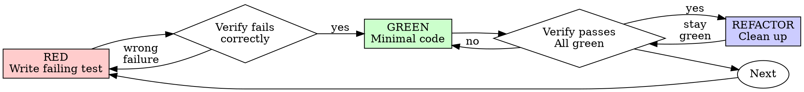

# 测试驱动开发(Test-Driven Development,TDD)

## 概览

先写测试。看着它失败。写最小代码让它通过。

**核心原则:** 如果你没有亲眼看测试失败,你就不知道它测的是不是对的东西。

**违反规则的字面,就是违反规则的精神。**

## 何时使用

**总是:**
- 新功能
- Bug 修复
- 重构
- 行为变更

**例外(问你的人类伙伴):**
- 用完即弃的原型
- 生成的代码
- 配置文件

在想「就这一次跳过 TDD」?停。那是合理化借口。

## 铁律(The Iron Law)

```
NO PRODUCTION CODE WITHOUT A FAILING TEST FIRST
```

没有失败测试在前,禁止写任何生产代码。

测试还没写就把代码写了?删掉。从头来。

**没有例外:**
- 不要留作「参考」
- 不要一边写测试一边「改编」它
- 不要看它
- 删除就是删除

从测试出发重新实现。句号。

## Red-Green-Refactor



### RED——写失败测试

写一个最小的测试,展示应该发生什么。

<Good>
```typescript
test('retries failed operations 3 times', async () => {
  let attempts = 0;
  const operation = () => {
    attempts++;
    if (attempts < 3) throw new Error('fail');
    return 'success';
  };

  const result = await retryOperation(operation);

  expect(result).toBe('success');
  expect(attempts).toBe(3);
});
```
名字清晰、测真实行为、只测一件事
</Good>

<Bad>
```typescript
test('retry works', async () => {
  const mock = jest.fn()
    .mockRejectedValueOnce(new Error())
    .mockRejectedValueOnce(new Error())
    .mockResolvedValueOnce('success');
  await retryOperation(mock);
  expect(mock).toHaveBeenCalledTimes(3);
});
```
名字含糊、测的是 mock 而不是代码
</Bad>

**要求:**
- 一个行为
- 清晰的名字
- 真实代码(除非不可避免,否则不用 mock)

### 验证 RED——看着它失败

**强制。永不跳过。**

```bash
npm test path/to/test.test.ts
```

确认:
- 测试失败(不是报错)
- 失败消息符合预期
- 是因为功能缺失而失败(不是笔误)

**测试通过了?** 你在测既有行为。修测试。

**测试报错了?** 修掉报错,重跑直到它以正确的方式失败。

### GREEN——最小代码

写能让测试通过的最简单代码。

<Good>
```typescript
async function retryOperation<T>(fn: () => Promise<T>): Promise<T> {
  for (let i = 0; i < 3; i++) {
    try {
      return await fn();
    } catch (e) {
      if (i === 2) throw e;
    }
  }
  throw new Error('unreachable');
}
```
刚好够通过
</Good>

<Bad>
```typescript
async function retryOperation<T>(
  fn: () => Promise<T>,
  options?: {
    maxRetries?: number;
    backoff?: 'linear' | 'exponential';
    onRetry?: (attempt: number) => void;
  }
): Promise<T> {
  // YAGNI
}
```
过度设计
</Bad>

不要加功能、不要重构其他代码、不要在测试之外「改进」任何东西。

### 验证 GREEN——看着它通过

**强制。**

```bash
npm test path/to/test.test.ts
```

确认:
- 测试通过
- 其他测试仍然通过
- 输出干净(没有错误、没有警告)

**测试失败?** 修代码,不是修测试。

**其他测试失败?** 现在就修。

### REFACTOR——清理

只在变绿之后:
- 消除重复
- 改进命名
- 提取辅助函数

保持测试全绿。不要加行为。

### 重复

为下一个功能写下一个失败测试。

## 好测试(Good Tests)

| 品质 | 好 | 坏 |
|---------|------|-----|
| **最小** | 一件事。名字里有「和」?拆开。 | `test('validates email and domain and whitespace')` |
| **清晰** | 名字描述行为 | `test('test1')` |
| **表达意图** | 展示期望的 API | 让人看不出代码该做什么 |

写或改任何测试时,读 `${CLAUDE_PLUGIN_ROOT}/references/writing-good-tests.md`,里面是让测试保持诚实的规则:
- 在写测试之前,先说出「什么样的生产代码改动会让这个测试失败」
- 对真实行为断言,绝不对 mock 的行为断言
- 只服务测试的代码放在测试工具里,不进生产类
- mock 一个依赖之前,先理解它的副作用

## 常见合理化借口(Common Rationalizations)

| 借口 | 现实 |
|--------|---------|
| 「太简单了不用测」 | 简单代码也会坏。测试只要 30 秒。 |
| 「我之后再补测试」 | 事后写的测试立刻通过——这什么也证明不了。它们可能测错了东西、测的是实现而非行为、或漏掉了你忘掉的边界情形。你从没看过它失败,所以你从没证明过它能抓住 bug。测试先行强迫那次失败发生。 |
| 「事后测试达到同样目的(重精神不重仪式)」 | 事后测试回答「它做了什么」;先行测试回答「它应该做什么」。事后写的测试被你已经写出的代码带偏——你验证的是你记得的用例,而不是你本会发现的用例。有覆盖率,却没有「测试有效」的证据。 |
| 「已经手动测过了」 | 手动测试是临时性的:没有覆盖记录,代码变了没法重跑,压力下容易漏用例。「我试的时候是好的」≠ 全面。自动化测试每次以同样方式运行。 |
| 「删掉 X 小时的工作太浪费」 | 沉没成本谬误——那些时间无论如何都已花掉。真正的选择是:用 TDD 重写(高置信)vs. 留着它事后补测试(低置信、很可能有 bug)。留着你无法信任的代码才是浪费。 |
| 「留着当参考,先写测试」 | 你会改编它。那就是事后测试。删除就是删除。 |
| 「需要先探索一下」 | 可以。探索完扔掉,用 TDD 开始。 |
| 「难测 = 设计不清」 | 听测试的。难测 = 难用。 |
| 「TDD 会拖慢我」 | TDD 就是务实的路:在提交前抓住 bug、防止回归、让你无畏重构。「务实」的捷径意味着在生产环境调试——更慢,不是更快。 |
| 「手动测更快」 | 手动证明不了边界情形。每次改动你都得重测。 |
| 「既有代码本来就没测试」 | 你正在改进它。为既有代码补测试。 |

## 红旗——STOP,从头再来(Red Flags)

- 代码先于测试
- 测试在实现之后写
- 测试立刻通过
- 解释不了测试为什么失败
- 测试「稍后」补
- 合理化「就这一次」
- 「我已经手动测过了」
- 「事后测试达到同样目的」
- 「重精神不重仪式」
- 「留作参考」或「改编既有代码」
- 「已经花了 X 小时,删掉太浪费」
- 「TDD 是教条,我这是务实」
- 「这次不一样,因为……」

**以上每一条都意味着:删掉代码,用 TDD 从头来。**

## 示例:Bug 修复

**Bug:** 空 email 被接受

**RED**
```typescript
test('rejects empty email', async () => {
  const result = await submitForm({ email: '' });
  expect(result.error).toBe('Email required');
});
```

**验证 RED**
```bash
$ npm test
FAIL: expected 'Email required', got undefined
```

**GREEN**
```typescript
function submitForm(data: FormData) {
  if (!data.email?.trim()) {
    return { error: 'Email required' };
  }
  // ...
}
```

**验证 GREEN**
```bash
$ npm test
PASS
```

**REFACTOR**
如有需要,为多个字段提取统一的校验。

## 验证清单(Verification Checklist)

在标记工作完成之前:

- [ ] 每个新函数/方法都有测试
- [ ] 实现之前亲眼看每个测试失败
- [ ] 每个测试失败的原因符合预期(功能缺失,不是笔误)
- [ ] 为每个测试写了最小代码
- [ ] 所有测试通过
- [ ] 输出干净(没有错误、没有警告)
- [ ] 测试用真实代码(万不得已才用 mock)
- [ ] 边界情形与错误路径已覆盖

有勾打不上?你跳过了 TDD。从头来。

## 卡住了怎么办(When Stuck)

| 问题 | 解法 |
|---------|----------|
| 不知道怎么测 | 写出你想要的 API。先写断言。问你的人类伙伴。 |
| 测试太复杂 | 设计太复杂。简化接口。 |
| 什么都得 mock | 代码耦合太紧。用依赖注入。 |
| 测试 setup 巨大 | 提取辅助函数。还复杂?简化设计。 |

## 与调试的衔接(Debugging Integration)

发现 bug?写一个复现它的失败测试(根因不明时先走 `/speccode:systematic-debugging`)。遵循 TDD 循环。测试既证明修复有效,也防止回归。

永远不要在没有测试的情况下修 bug。

## 最终规则(Final Rule)

```
生产代码 → 测试存在且先失败过
否则 → 不是 TDD
```

没有人类伙伴的许可,没有例外。
