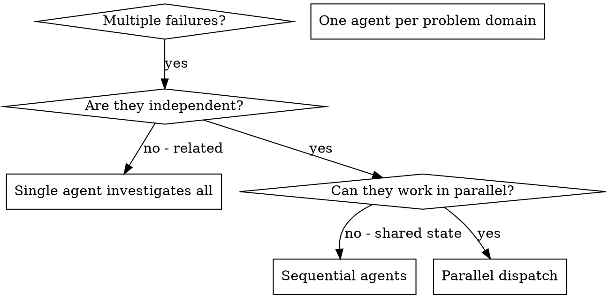

# 派发并行子代理(Dispatching Parallel Agents)

## 概览

> **宿主能力依赖**:本 skill 依赖宿主的子代理派发能力。宿主无子代理时,各任务由主代理在当前会话串行完成(不并行、不降级到其他 skill)。

你把任务委派给拥有隔离上下文的专门代理。通过精确构造它们的指令与上下文,你确保它们聚焦并胜任自己的任务。它们绝不应继承你会话的上下文或历史——你要精确构造它们需要的一切。这也把你自己的上下文留给协调工作。

当你有多个互不相关的失败(不同的测试文件、不同的子系统、不同的 bug)时,串行逐个调查是在浪费时间。每个调查都是独立的,可以并行进行。

**核心原则:** 每个独立问题域派发一个代理,让它们并发工作。

## 何时使用



**使用场景:**
- 3+ 个测试文件失败,根因各不相同
- 多个子系统各自独立地损坏
- 每个问题不需要其他问题的上下文就能理解
- 调查之间没有共享状态

**不要使用,当:**
- 失败互相关联(修好一个可能顺带修好其他的)
- 需要理解完整的系统状态
- 代理之间会相互干扰

## 前置:开发分支

1. **trunk 防护**:`git rev-parse --abbrev-ref HEAD` 必须为非 trunk 的 `<type>/<slug>` 形态分支;否则退出并提示「请在开发分支上运行本命令」(防止直提 trunk)。(`read-config` 先跑,为 null → 提示先 `/speccode:init` 并退出)
2. **会写代码的代理需要隔离工作区**:并行代理 MUST NOT 在同一个工作目录里相互踩踏——要么把它们的文件范围切成互不相交,要么为每个代理建独立 worktree(经 `/speccode:creating-worktree`,slug 加后缀区分,如 `<type>/<slug>-api`)。只读调查类代理(不改文件)可直接并行。

## 模式(The Pattern)

### 1. 识别独立域

按「坏掉的是什么」给失败分组:
- 文件 A 的测试:工具批准流程
- 文件 B 的测试:批量完成行为
- 文件 C 的测试:中止功能

每个域相互独立——修工具批准流程不影响中止功能的测试。

### 2. 创建聚焦的代理任务

每个代理拿到:
- **具体范围:** 一个测试文件或一个子系统
- **明确目标:** 让这些测试通过
- **约束:** 不要改其他代码
- **期望产出:** 你发现了什么、修了什么的小结

### 3. 并行派发

在同一条回复里发出全部三个子代理派发——它们并行运行:

```text
Subagent: "Fix agent-tool-abort.test.ts failures"
Subagent: "Fix batch-completion-behavior.test.ts failures"
Subagent: "Fix tool-approval-race-conditions.test.ts failures"
# All three run concurrently.
```

一条回复里多个派发调用 = 并行执行。一条回复一个 = 串行。

### 4. 审查并集成

代理返回时:
- 读每份小结
- 验证修复互不冲突
- 跑完整测试套件
- 集成所有变更

## 代理 Prompt 结构

好的代理 prompt 是:
1. **聚焦的** - 一个清晰的问题域
2. **自包含的** - 理解问题所需的全部上下文
3. **对产出具体** - 代理应该返回什么?

```markdown
修复 src/agents/agent-tool-abort.test.ts 里 3 个失败的测试:

1. "should abort tool with partial output capture" - 期望消息中含 'interrupted at'
2. "should handle mixed completed and aborted tools" - 快工具被中止而非完成
3. "should properly track pendingToolCount" - 期望 3 个结果但得到 0 个

这些是时序/竞态条件问题。你的任务:

1. 读测试文件,理解每个测试验证什么
2. 识别根因 - 时序问题还是真实的 bug?
3. 通过以下方式修复:
   - 用基于事件的等待替换拍脑袋的 timeout
   - 如发现 abort 实现里的 bug,修掉它
   - 如测试在测一个已改变的行为,调整测试期望

不要只是调大 timeout - 找到真正的问题。

返回:你发现了什么、修了什么的小结。
```

## 常见错误

**❌ 太宽泛:** "修好所有测试" - 代理会迷路
**✅ 具体:** "修好 agent-tool-abort.test.ts" - 聚焦的范围

**❌ 没上下文:** "修一下那个竞态" - 代理不知道在哪
**✅ 有上下文:** 把错误消息和测试名贴进去

**❌ 没约束:** 代理可能把一切都重构了
**✅ 有约束:** "MUST NOT 改生产代码" 或 "只修测试"

**❌ 产出含糊:** "修好它" - 你不知道改了什么
**✅ 具体:** "返回根因与所做变更的小结"

## 何时不使用

**相关联的失败:** 修好一个可能顺带修好其他的——先放在一起调查
**需要完整上下文:** 理解问题需要看到整个系统
**探索式调试:** 你还不知道是什么坏了
**共享状态:** 代理会相互干扰(编辑同一批文件、占用同一份资源)

## 真实会话示例

**场景:** 一次大重构之后,3 个文件共 6 个测试失败

**失败:**
- agent-tool-abort.test.ts: 3 个失败(时序问题)
- batch-completion-behavior.test.ts: 2 个失败(工具未执行)
- tool-approval-race-conditions.test.ts: 1 个失败(执行计数 = 0)

**决策:** 独立域——abort 逻辑、批量完成、竞态条件三者各自独立

**派发:**
```
Agent 1 → 修 agent-tool-abort.test.ts
Agent 2 → 修 batch-completion-behavior.test.ts
Agent 3 → 修 tool-approval-race-conditions.test.ts
```

**结果:**
- Agent 1: 用基于事件的等待替换了 timeout
- Agent 2: 修了事件结构 bug(threadId 放错了位置)
- Agent 3: 加了「等待异步工具执行完成」

**集成:** 所有修复相互独立,无冲突,完整套件全绿

## 验证

代理返回后:
1. **审查每份小结** - 理解改了什么
2. **检查冲突** - 代理们改了同一段代码吗?
3. **跑完整套件** - 验证所有修复合在一起能工作
4. **抽查** - 代理可能犯系统性错误
